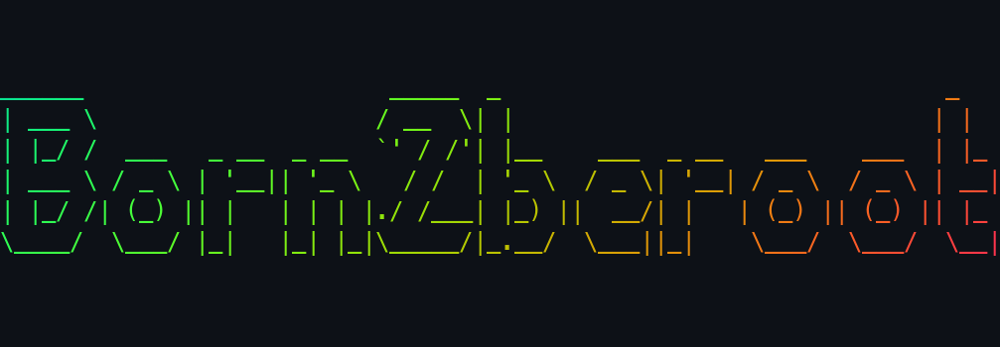

# born2beroot

<p align="center">
    
</p>

<p align="center" >This project is about creating a minimal Virtual Machine and configuring it to be suitable for being a server.</p>

---
<p align="center">
    This repository has a few study lines that I consider necessary Knowledge for this project, my script and a checklist for verifying if your machine is set up right! It also has a guide with a step-by-step that allows you to configure the project (with bonus!) in less than 20 minutes, but it is encrypted. Good luck!
</p>

### Virtualization
Virtualization is a process that uses a piece of software called hypervisor to create a layer over the computer hardware (physical resources like CPU and RAM) that allows these elements to be divided into multiple virtual computers (usually called virtual machines). With this tool, we don't need to have hundreds of computers to store hundreds of servers, we can have a single physical computer with extra resources (extra RAM and extra CPU Cores) and in the host operating System of that machine, we virtualize other operating systems. Nowadays, there are tons of different softwares that are made to manage and organize multiple VMs, the most known being the one made by Oracle, Virtual Box, but you could use any Virtual Machine Manager of your preference (not for this project, though, only Virtual Box and UTM are allowed, at least when I submitted mine in 2023). An important detail to clarify the communication in this article is the definition of host and guest machines:
- Host machine and Host OS are the physical computer and the primary OS running on it.
- Guest machine and Guest OS are the virtualized hardware and OS running in the Host machine and Host OS.


### Linux Distributions
In this project, the OS that we are going to virtualize is a Linux Distribution, either Debian or Rocky. Debian is a very famous distribution notorious for its stability and reliability without being overcomplicated, so it is ideal for many cases, from using it as a daily driver OS to making your own personal server. Rocky is derived from a distribution called CentOS; both are derived from the Red Hat distribution. The main difference is that usually Red Hat based distributions are aimed for the enterprise environment; in professional cases, they are therefore often more complex to learn and use than Debian based distributions.

### Partitioning
When installing your distribution of choice, you will face a step that is called **Partitioning**. Partitioning is a logical division of a persistent drive (HD, SSD, etc.) that is treated as a separate Unit by the OS. In short, it is like if you divided your Disk into several organized subdisks, but in a logical way, i.e., divided by software and not physically. Partitions can have a few characteristics, like:
- **Mount points**: allow data stored on separated partitions to be accessed by the OS filesystem.
- **Size**: The amount of bytes that the partition could store.
- **File system**:  The specific system that will deal with files in the OS could be ext4 for common storage partitions or something for a different purpose like the SWAP area, which is instead for use when the RAM is full, and you need immediately a few more memory, than it uses the space on the disk as RAM. 

<p align="center">

</p>

### LVM
When partitioning, you'll also encounter something called LVM, which stands for Logical Volume Manager. VLM is a much more flexible method of partitioning than the traditional one. And this is true due to some extra tools that a LVM provides, like Volume Groups and Logical Volumes.

### Users
Linux OS's are operational systems that require you to log in before you start using it, at least for all the distributions that I used. To do that, we need to create users, and the first users you'll create will be in the installation process. On Debian it will force you to create a Root User and allow you to create a Standard User, Let's understand the differences between root users and standard users. 

The root user is the Admin of the system; he owns everything, has access to everything, and can do everything without asking for permissions. Reading like that, why do we need to use anything different from that? I want all the power! Well, the problem is that if you mess something up, it could cause irreversible damage like permanent data loss or even worse. So the best practice is to create a User aside from root, a common user, that will at most times have limited access to the system. Another scenario that could make it clear that using root all the time is bad is if you start thinking about Linux as not only a personal OS but an OS that could be on a machine where multiple people work, and not everyone should be able to do everything, some people should have a lower access, others higher access, and others full access. This is called access control and is crucial for the security of sensitive systems.

### Groups and Sudo
Aside from users, Linux also has a tool called Groups, which is a way to give and take different levels of access to different users in the system. For example, I could create a group Called Developer, which can access and modify the server configuration files in my application but can't access and modify the main database. Aside from normal groups, there is a special tool that adds a special group called Sudo. Sudo stands for Super User Do, and it is a group that the root user has to put users in if he wants these users to have temporary Root Access, i.e., if a user wants to perform an action that only the root user could do, he can use the command Sudo (only if this user is part of the Sudo Group, obviously) and execute only this command as root.

### Password policy
Another common security practice is to set a strict password policy for all Users. The advantage of that is to try to minimize human flaws and human based security breaches, like users who write down their password and lose the paper, share their password with other people, or set weak passwords like "passwd123". A good password policy should make passwords expire eventually; the password itself has to be strong with a minimum length and a minimum number of special characters or numbers; the password can't have the user's own  username; and the list goes on.

### Package Managers (Apt and Aptitude)
On Linux, the way to download and get access to applications and packages is through a piece of software called Package Manager; on Debian systems, we have Apt and Aptitude. A package manager is responsible for downloading, updating and upgrading packages in an easy, organized, fast and secure way. The difference between apt and aptitude is that Apt is a simple command line for utilizing it, with raw commands and not so smart tools, you have to tell it what you want it to do. And aptitude is a higher level package manager with a kind of graphical interface and some features, like when you tell it to delete a package, it automatically deletes all its dependencies that will not be necessary anymore.

### Services (daemons)
Services (or daemons) are programs that run in the background without the need for constant execution from a user. In born2beroot there are 3 mandatory services to use:
- **ufw**: ufw (Uncomplicated Firewall) is a firewall service, which is a security service that monitors and controls incoming and outgoing network traffic and chooses to allow or block traffic and ports. For example, with ufw you can allow port 443 (the standard HTTPS port) so that HTTPS can be served by this machine and block port 80 so that HTTP cannot be served.
- **SSH**: SSH stands for Secure Shell, and it is a network protocol intended for remote access to machines in a very secure way, even if the network used isn't secure. It is extremely useful for accessing servers without the need to go physically to the server location.
- **Cron**: Cron is a service that allows for scheduling actions on specific dates and times. For example, you could set a cron job to delete all files from a specific directory at 21:00 every day.

### sha1sum Cryptography
When you finish your VM and are ready to submit it, you'll have to take a hash from your VM disk, but what exactly does that mean? Cryptography is the basic concept of hiding or coding information so that it can't be read easily. But that isn't the only use for cryptographic algorithms, we can, with some of them, summarize a gigantic piece of information in a small **hash**. In this project, the only thing you have produced is a Virtual Disk that has between 8GB and 30GB, and you can imagine that it would not be wise to commit that to a git repository that will be stored inside Intra Network. So, what we'll do is use a cryptographic algorithm (I'll use sha1sum as an example because I made this project on a Linux machine at the time) to summarize these tons of GB's into a simple hash. Find your Virtual Disk and execute (it can take a while, be patient):
```bash
sha1sum virtual_disk_name.vd1
```
The output will be something similar to `92429d82a41e930486c6de5ebda9602d55c39986`. This code, is unique, and the sha1sum guarantees that it is **almost** impossible to generate a hash identical to this. To produce this, the input was every single byte in our disk, if a single byte is changed in the disk (for example, if you create a single file inside the VM), the hash will be **completely** different. So keep in mind that after you take the hash of the disk that will be submitted, **you can't open the original VM anymore** because if you boot into it, a log file of your boot attempt will be written, the disc impression will change, and you are now Fucked Up. Make snapshots, Clones, or anything other than booting the original VM.
